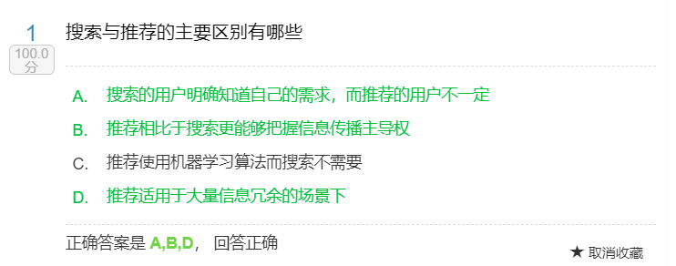

土壤：信息过载

核心矛盾：大量信息 vs 有限资源

亚马逊电商推荐例子：

- 主页上——与您浏览过的商品相关的推荐：上下文推荐（与主商品无关）
- 一个商品详情页——浏览此商品的顾客也同时浏览

### PC时代到移动时代

- 核心变化

  - 屏幕变小
  - 内容更多
  - 用户时间更多
  - 场景更多

- 挑战

  - 犯错机会更少（展示机会少，犯错少更有可能导致用户离开）
  - 场景更复杂（场景多）

- 机会

  - 过滤需求多
  - 展现机会多
  - 训练数据多
  - C位出道机会多

  ​

### 移动时代的推荐

特点：

- 注意力高度聚焦
- 沉浸式体验
- 占据主要地位
- 撑起独立应用

### 推荐作为一种思维方式

- 作为搜索的延伸
- 作为广告的土壤
- 掌握信息传播主动权
  - 用户想看什么
  - 想让用户看什么

应用场景：

- 资源受限的信息过滤
- 导向性的信息展现
- 目的性的资源分配

### 题目

