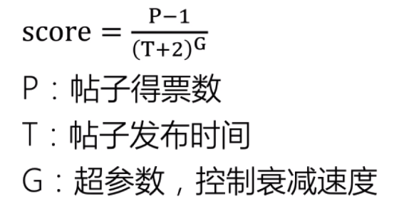

### 早期论坛信息过滤——Hacker News

打分方式

### 早期论坛信息过滤——Reddit

用户投票得分

### 早期社交网络推荐——Facebook

社交Feed流：

- 亲密度
- 互动类型
- 新鲜度

EdgeRank算法：

### 早期电商推荐——Amazon

前面算法特点：无个性化

个性化始祖：协同过滤

- User-base:用物品识别人
- Item_base:用人识别物品

脱离人工造公式阶段

### 单一算法到多算法融合

基于行为：

- 协同过滤的变种
- 随机游走等

基于内容：

- 文本相关性算法
- 主题相关性算法

结果融合：

- 人工规则
- 启发式优化

融合结果：

- 维度更丰富
- 结果更多样

### 引入机器学习模型

以上缺点：

- 启发式，无明确目标
- 相对静态，反应慢
- 考虑维度少，个性化不足
- 纯手工，改进空间少

### 从浅层模型到深度学习模型

浅层模型

- LR、GBDT
- 特征组合

半深度模型

- FM、FFM

深度模型

- Wide & Deep
- Embedding
- LSTM
- ESMM
- TDM
- ...

