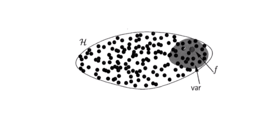

### 损失函数的bias-variance分解

- 如何减少bias？You can't improve it if you can't measure it.构建损失函数来衡量
  - 衡量bias：MSE
  - 代理bias：交叉熵
- 如何减少variance？方差过大的原因就是给的搜索空间太大了。
  - 控制搜索空间
    - 目的：学习信息，不学噪音
    - 方法：正则化
      - 线性模型：限制参数的大小、数量
      - 树模型：限制深度、数量、分裂条件
    - 正则化核心思想：
      - 限制搜索空间
      - 制衡VC维

以下是限制搜索空间减小方差的图示：