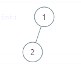
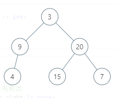

Leetcode [111. 二叉树的最小深度](https://leetcode-cn.com/problems/minimum-depth-of-binary-tree/)

难度：简单

用法：DFS

> 给定一个二叉树，找出其最小深度。
>
> 最小深度是从根节点到最近叶子节点的最短路径上的节点数量。
>
> **说明:** 叶子节点是指没有子节点的节点。
>
> **示例:**
>
> 给定二叉树 `[3,9,20,null,null,15,7]`,
>
> ```
>     3
>    / \
>   9  20
>     /  \
>    15   7
> ```
>
> 返回它的最小深度  2.


> 注意1：下方的二叉树最小深度=2。



> 注意2：下方的二叉树最小深度=3。



### 解法一

递归：

```python
# Definition for a binary tree node.
# class TreeNode:
#     def __init__(self, x):
#         self.val = x
#         self.left = None
#         self.right = None

class Solution:
    def minDepth(self, root: TreeNode) -> int:
        if not root: return 0
        LD = self.minDepth(root.left)
        RD = self.minDepth(root.right)
        return LD+RD+1 if (not root.left) or (not root.right) else min(LD, RD)+1
```

### 解法二

DFS

```python
# Definition for a binary tree node.
# class TreeNode:
#     def __init__(self, x):
#         self.val = x
#         self.left = None
#         self.right = None

class Solution:
    def minDepth(self, root: TreeNode) -> int:
        if not root: return 0
        stack = [(1, root)]
        min_depth = float('inf')
        while stack:
            depth, node = stack.pop()
            if not node.left and not node.right:
                min_depth = min(min_depth, depth)
            if node.right:
                stack.append((depth + 1, node.right))
            if node.left:
                stack.append((depth + 1, node.left))       
        return min_depth 
```

### 方法三

BFS1

```python
# Definition for a binary tree node.
# class TreeNode:
#     def __init__(self, x):
#         self.val = x
#         self.left = None
#         self.right = None

class Solution:
    def minDepth(self, root: TreeNode) -> int:
        if not root: return 0
        queue = [(1, root)]
        while queue:
            depth, node = queue.pop(0)
            if not node.left and not node.right:
                return depth
            if node.left:
                queue.append((depth + 1, node.left))
            if node.right:
                queue.append((depth + 1, node.right))
```

BFS2

更容易理解，事实证明这个是用时最短，内存较少的算法。

```python
# Definition for a binary tree node.
# class TreeNode:
#     def __init__(self, x):
#         self.val = x
#         self.left = None
#         self.right = None

class Solution:
    def minDepth(self, root: TreeNode) -> int:
        if root is None:
            return 0
        depth = 1
        queue = [root]
        while queue:
            lens = len(queue)
            for i in range(lens):
                p = queue.pop(0)#切记要先取出
                if p.left is None and p.right is None:
                    return depth
                if p.left:
                    queue.append(p.left)
                if p.right:
                    queue.append(p.right)
            depth += 1
        return depth
```

