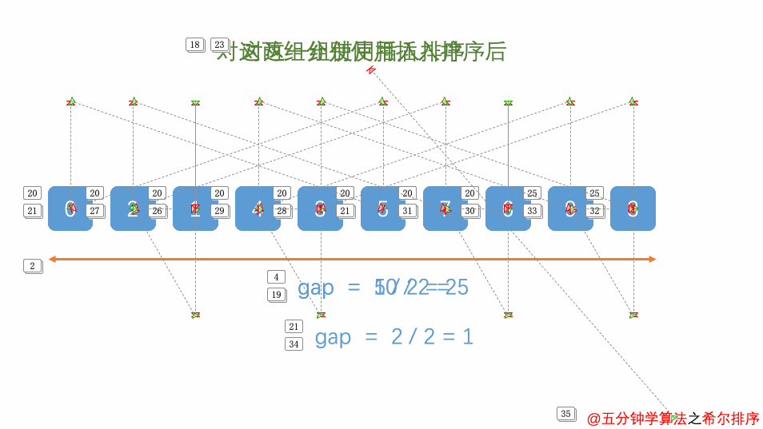

### 步骤

- 将数据分成d = n//2 组，每一趟希尔排序从元素d开始，采用直接插排。

- 每个元素的比较和插入均在同一组内进行。

- 更新d = d//2 。

- 直到d=0时停止，当d=1时，相当于对近乎有序的结果进行一次完整的直接插排。

  ​

### 图解

[图片来源](https://xiaozhuanlan.com/topic/6439782051)




### 复杂度

- 时间复杂度：
  - 最好的情况，时间复杂度$O(n)$。
  - 最差的情况，时间复杂度$(n^2)$。
  - 平均的情况，时间复杂度$O(n^{1.3})$。
- 空间复杂度：$O(1)$


### 算法

```python
def ShellSort(List):
    d = n//2
    while d>0:
        for i in range(d,len(List)):
            cur = List[i]
            pos = i-d 
            while pos >= 0 and List[pos] > cur: 
                List[pos+d] = List[pos]
                pos -= d
            List[pos+d] = cur
        d = d//2
    return List
```


