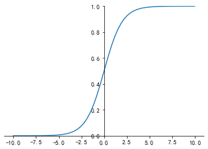
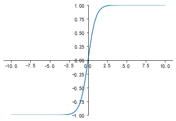
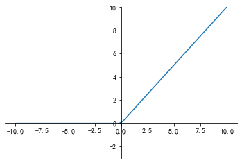
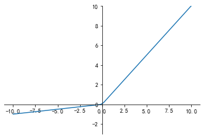

### 神经网络简介

目前最广泛使用的定义是Kohonen于1988年的描述，神经网络是由具有适应性的简单单元组成的广泛并行互连的网络，它的组织能够模拟生物神经系统对真实世界物体所做出的交互反应。

### 激活函数

类似人的神经，神经网络的神经元只有当达到一定的程度时才会会激活，才能向其他神经元发送信号。

### 激活函数非线性

神经网络计算过程，每层都是在做矩阵乘法运算，层数再多，输出的仍然是输入的线性组合。因此，需要激活函数引入非线性因素，使网络逼近任意非线性函数。

早期激活函数：sigmoid、tanh

近年激活函数：Relu、Leaky-Relu、P-Relu、R-Relu

##### sigmoid

$y=\frac{1}{1+e^{-z}}$，导数$y^\prime=y(1-y)$

优点：

- 将数据映射到0-1之间，非常小的视为0，非常大的视为1（起到抑制作用）

缺点：

 - 指数运算，开销大。
 - input很小，y=0，梯度=0；相反，y=1，梯度=0，参数更新慢。梯度弥散。

应用：

- 基本上只有在做二分类（0，1）时的输出层才会使用。

##### tanh

$y=\frac{e^z-e^{-z}}{e^z+e^{-z}}$ 导数：$y^\prime =1 - y^2$ 

tanh是双曲正切函数,输出区间是在(-1,1)之间，而且整个函数是以0为中心。

优点：

- 以0为中心，起到归一化（均值为0）的效果。

缺点：

- 输入较大或者较小，梯度=0，已造成梯度弥散。

应用：

- 一般二分类问题中，输出层用sigmoid函数，早期隐藏层用tanh函数，Relu出现之后，隐藏层都用Relu了。

##### ReLU

Rectified Linear Units修正线性单元

$y=max(0,z)$，大于0时导数=1，小于0时导数=0.

优点：

- 更新速度比sigmoid与tanh快。
- 只需判断输入正负就知道梯度，无需求导，提高基于梯度算法运算速度。

缺点：

- 正向传播，输入<0，ReLU完全不会被激活，此时ReLU就会死掉。
- 反向传播，输入<0，梯度=0，梯度弥散。

##### Leaky-ReLU

为解决ReLU输入负数梯度为0的问题。

$y=max(\alpha z, z)$，通常$\alpha = 0.01$。

优点：

- ReLU的优点。

应用：

- 实际中，并没有证明Leaky-ReLU总是好于ReLU。
- 目前ReLU最常用，隐藏层首选推荐！

