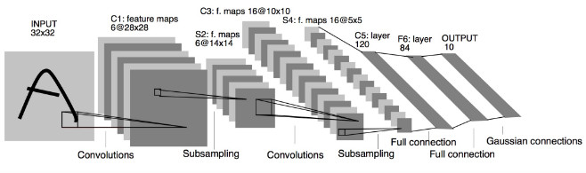

### LeNet-5

1998， Yann LeCun 的 LeNet5 [官网](http://yann.lecun.com/exdb/lenet/index.html)

卷积神经网路的开山之作，麻雀虽小，五脏俱全，卷积层、pooling层、全连接层，这些都是现代CNN网络的基本组件。

- 用卷积提取空间特征；
- 由空间平均得到子样本；
- 用 tanh 或 sigmoid 得到非线性；
- 用 multi-layer neural network（MLP）作为最终分类器；
- 层层之间用稀疏的连接矩阵，以避免大的计算成本。

**输入：**图像Size为32x32。这要比mnist数据库中最大的字母(28*28)还大。这样做的目的是希望潜在的明显特征，如笔画断续、角点能够出现在最高层特征监测子感受野的中心。

**输出：**10个类别，分别为0-9数字的概率

1. C1层是一个卷积层，有6个卷积核（提取6种局部特征），核大小为5 * 5
2. S2层是pooling层，下采样（区域:2 * 2 ）降低网络训练参数及模型的过拟合程度。
3. C3层是第二个卷积层，使用16个卷积核，核大小:5 * 5 提取特征
4. S4层也是一个pooling层，区域:2*2
5. C5层是最后一个卷积层，卷积核大小:5 * 5 卷积核种类:120
6. 最后使用全连接层，将C5的120个特征进行分类，最后输出0-9的概率

一下代码来自[官方教程](https://pytorch.org/tutorials/beginner/blitz/neural_networks_tutorial.html)

```python
import torch
import torch.nn as nn
class LeNet5(nn.Module):

    def __init__(self):
        super(LeNet5, self).__init__()
        # 1 input image channel, 6 output channels, 5x5 square convolution
        # kernel
        self.conv1 = nn.Conv2d(1, 6, 5)
        self.conv2 = nn.Conv2d(6, 16, 5)
        # an affine operation: y = Wx + b
        self.fc1 = nn.Linear(16 * 5 * 5, 120) # 这里论文上写的是conv,官方教程用了线性层
        self.fc2 = nn.Linear(120, 84)
        self.fc3 = nn.Linear(84, 10)

    def forward(self, x):
        # Max pooling over a (2, 2) window
        x = F.max_pool2d(F.relu(self.conv1(x)), (2, 2))
        # If the size is a square you can only specify a single number
        x = F.max_pool2d(F.relu(self.conv2(x)), 2)
        x = x.view(-1, self.num_flat_features(x))
        x = F.relu(self.fc1(x))
        x = F.relu(self.fc2(x))
        x = self.fc3(x)
        return x

    def num_flat_features(self, x):
        size = x.size()[1:]  # all dimensions except the batch dimension
        num_features = 1
        for s in size:
            num_features *= s
        return num_features


net = LeNet5()
print(net)
```

##### output:

```
LeNet5(
  (conv1): Conv2d(1, 6, kernel_size=(5, 5), stride=(1, 1))
  (conv2): Conv2d(6, 16, kernel_size=(5, 5), stride=(1, 1))
  (fc1): Linear(in_features=400, out_features=120, bias=True)
  (fc2): Linear(in_features=120, out_features=84, bias=True)
  (fc3): Linear(in_features=84, out_features=10, bias=True)
)
```