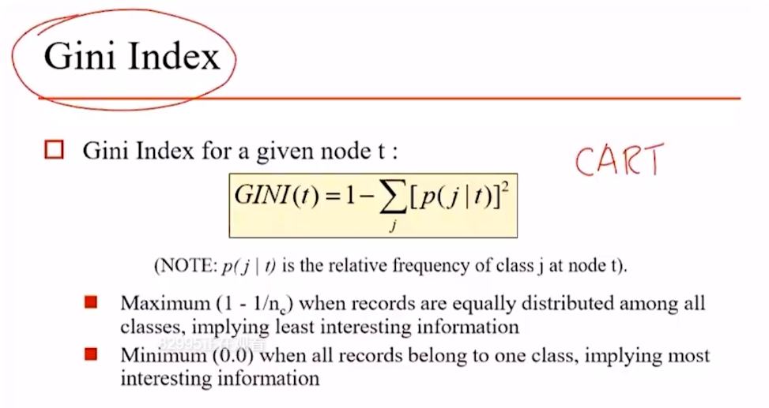
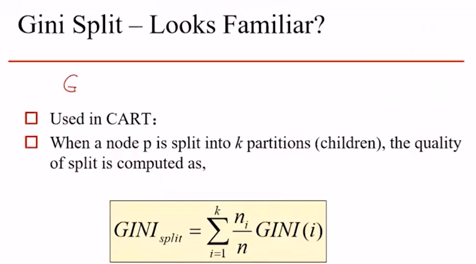

### 适用范围

CART则是不仅可以用于各种类型数据的分类（连续或离散），还可以用于回归分析（这一点通过Class And Regression Tree的命名可以看到），这里CART对于连续值的处理与C4.5是一致。

### Gini Index（相当于熵）

- 任意两次抽取不等的概率。
- 越小越好。
  - 越小表示两次抽取不等的概率越小。
  - 也就是两次抽取为相同的概率非常大。
  - 说明原始数据越纯，也就是原始数据中某一类占比非常大。

### Gini Split（相当于信息增益）

- Gini Index相当于熵，那熵如何指导特征划分，那就是信息增益。
- Gini Index又如何指导特征划分？这就是Gini Split。

