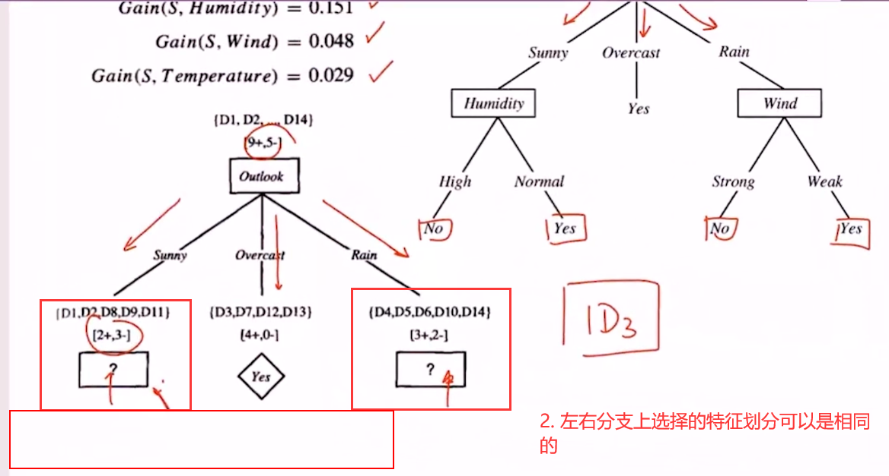
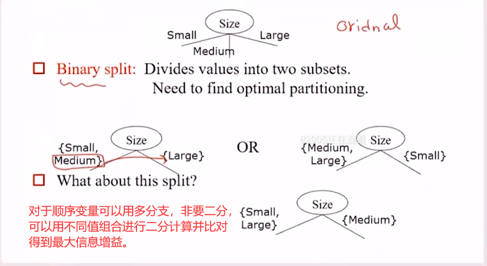

### 适用范围

ID3只用于离散的分类。

### 信息增益（Information Gain）

$$
Gain(A) = Entropy(A)-\sum_{A_{i}} W_{i}Entropy(A_{i})
$$

注意：

- $Entropy(A)$划分之前的信息熵。
- 本分将$A$划分成$A_{1},A_{2},\dots$不同的部分。
- 对每一个划分部分计算熵的加权和，即为划分之后的熵。
- 整体熵-划分熵表示，由于划分使得整体纯度提升了多少。
- 信息增益越大越好？
  - 信息增益分两部分，信息增益越大：整体熵一定情况下，划分加权信息熵越小。
  - 整体混乱，不纯度大，信息熵大，在此认为整体信息熵固定。
  - 那么，就希望划分之后各个部分都很纯，即划分加权信息熵越小。
  - 因此，信息增益越大也就越好。

### 划分原理

- 计算整体的信息熵，分别计算每个特征在不同取值上的加权信息熵，差值即为信息增益，这样最开始就会得到有与特征数量相同个信息增益值，找到最大的特征增益的划分属性作为根节点。
- 接下来的划分，就是从根节点属性之外进行继续划分属性。
- 左右分支的划分属性可以相同。
- 直到达到划分深度、叶子节点数等就停止生长。

### 特征类型

- 类别型：可以直接计算信息增益。
- 顺序型：也可以计算信息增益，针对二分可以采取组合特征值计算最佳组合的方式。
- 连续性：顺序排列连续属性的取值，遍历所有可能的相邻取值的均值进行二分，找到最优化分位置。

