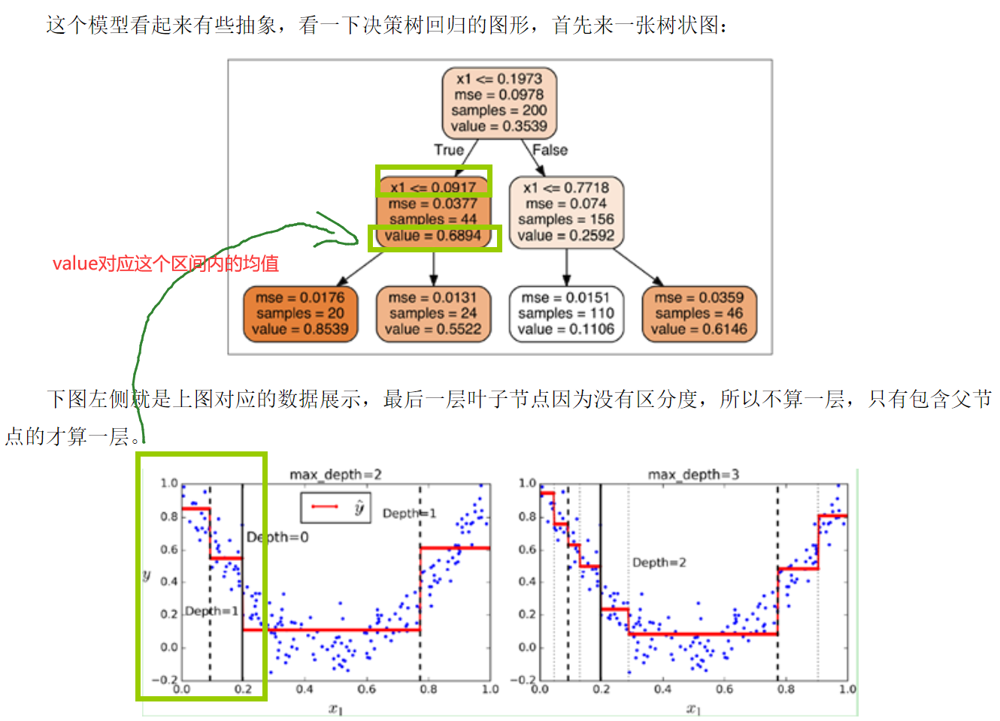

### 叶子节点是什么？

- 落到划分区间内样本的均值。

### 如何划分？

两步走：

- 针对一个特征遍历划分，找到均方误差（MSE）最小的划分点。
- 针对所有特征按照上述方法，最终比较，找出MSE最小属性以及对应的属性划分点。

公式：
$$
min_{j,s}[min_{c_{1} }\sum_{x_{i} \in R_{1}(j,s)}(y_{i}-c_{1})^2  +   min_{c_{2} }\sum_{x_{i} \in R_{2}(j,s)}(y_{i}-c_{2})^2 ]
$$

[图片来源](https://www.cnblogs.com/xiashiwendao/p/12168323.html)

