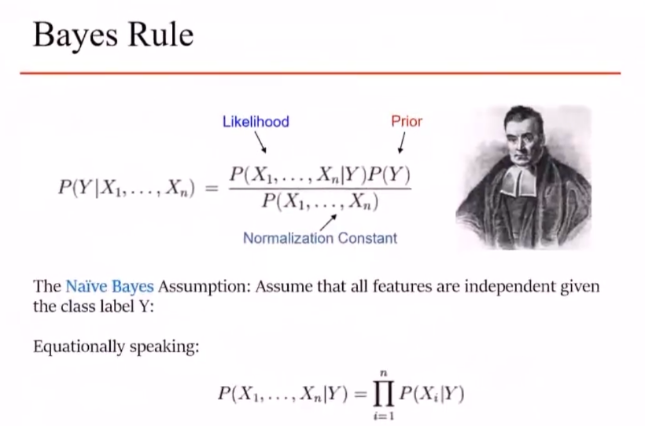

### 公式

$$
P(C|X) = \frac{P(X|C)P(C)}{P(X)}  = \frac{P(x_1,x_2,x_3,\ldots|C)P(C)}{P(X)}
$$

其中，$X$是高维特征，$C$是类别。

### 含义

- 给定高维特征$X$以及对应的类别$C$，经过学习，可以得出先验概率$P(C)$以及似然$P(x_1,x_2,x_3,\ldots|C)$。
- 最终可以在给定特征$X_k$去预测对应的类别$C_k$。

### 条件

- 特征$X$之间独立。

$$
P(X) = \prod_{i=1}P(x_i)
$$

- 概率和为1。

$$
\sum_{j=1}P(C_j|X) = 1
$$

### 最终

$$
P(C|X) = \frac{P(X|C)P(C)}{P(X)}  = \frac{\prod_{i=1}P(x_i|C)P(C)}{\sum_{j=1}P(X|C_j)P(C_j)}
$$

### 说明

### 朴素贝叶斯简化

