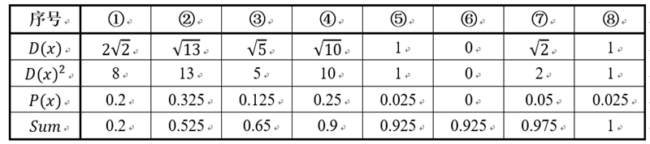

改进的K-Means算法。

K-Means缺点：

1）人工指定聚类数$K$。

2）收敛局部最优，效果受初始值影响很大。

3）对噪声敏感。

4）样本只能划分到单一类别。

##### 初始值选择

假设已经选取了n个初始聚类中心(0<n<K)，则在选取第n+1个聚类中心时：距离当前n个聚类中心越远的点会有更高的概率被选为第n+1个聚类中心。在选取第一个聚类中心(n=1)时同样通过随机的方法。可以说这也符合我们的直觉：聚类中心当然是互相离得越远越好。这个改进虽然直观简单，但是却非常得有效。

##### 详情

 [2007年由D. Arthur等人提出的K-means++针对图1中的第一步做了改进](http://ilpubs.stanford.edu:8090/778/1/2006-13.pdf)。可以直观地将这改进理解成这K个初始聚类中心相互之间应该分得越开越好。整个算法的描述如下图所示：

​      下面结合一个简单的例子说明K-means++是如何选取初始聚类中心的。数据集中共有8个样本，分布以及对应序号如下图所示：

​      假设经过图2的步骤一后6号点被选择为第一个初始聚类中心，那在进行步骤二时每个样本的**D(x)**和被选择为第二个聚类中心的概率如下表所示：

- P(x)：每个样本被选为下一个聚类中心的概率。
- Sum：是概率**P(x)**的累加和，用于**轮盘法**选择出第二个聚类中心。
- 方法：随机产生出一个0~1之间的随机数，判断它属于哪个区间，那么该区间对应的序号就是被选择出来的第二个聚类中心了。例如1号点的区间为[0,0.2)，2号点的区间为[0.2, 0.525)。

​      从上表可以直观的看到第二个初始聚类中心是1号，2号，3号，4号中的一个的概率为0.9。而这4个点正好是离第一个初始聚类中心6号点较远的四个点。这也验证了K-means的改进思想：即离当前已有聚类中心较远的点有更大的概率被选为下一个聚类中心。可以看到，该例的K值取2是比较合适的。当K值大于2时，每个样本会有多个距离，需要取最小的那个距离作为**D(x)**。