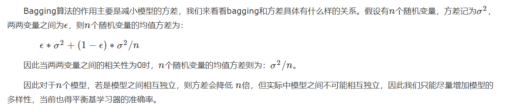

### 集成学习分类

集成算法是由多个弱学习器组成的算法，而对于这些弱学习器我们希望每个学习器的具有较好的准确性、而且各个学习器之间又存在较大的差异性，这样的集成算法才会有较好的结果，然而实际上准确性和多样性往往是相互冲突的，这就需要我们去找到较好的临界点来保证集成算法的效果。根据个体学习器的生成方式不同，我们可以将集成算法分成两类：

　　1）个体学习器之间存在强依赖关系，必须串行化生成的序列化方法，这一类的代表是Boosting（常见的算法有Adaboost、GBDT）；

　　2）个体学习器之间不存在强依赖关系，可以并行化生成每个个体学习器，这一类的代表是Bagging（常见的算法有RandomForest）。

### 个体学习具备

- 准确性。——最基本的。
- 多样性。——尽量保证模型之间独立，可以减少方差。

### 集成多样性原因

